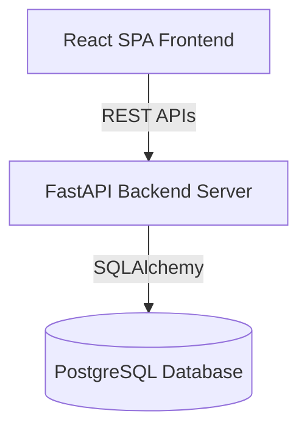

# Antigravity - Production-Ready Inventory & Order Management System

Antigravity is a containerized full-stack Inventory & Order Management System designed for businesses to manage products, customers, and sales orders. The application features a high-performance Python FastAPI backend, a responsive React frontend, and a PostgreSQL database.

---

## 🚀 Live Demo & Repository Resources

* **GitHub Repository:** https://github.com/Anubhav-01/inventory-system
* **Docker Hub Backend Image:** `[Insert Docker Hub Image Link Here]`
* **Frontend Hosted URL (e.g. Vercel/Netlify):** `[Insert Hosted Frontend URL Here]`
* **Backend API Hosted URL (e.g. Render):** `[Insert Hosted Backend API URL Here]`

---

## 🛠️ Technology Stack

1. **Backend API:** Python (FastAPI), SQLAlchemy ORM, Pydantic data validation.
2. **Frontend UI:** React (Vite), Lucide Icons, Glassmorphism CSS design system.
3. **Database:** PostgreSQL 15.
4. **Containerization:** Docker & Docker Compose.
5. **Deployment:** Render (Backend + Database) and Vercel/Netlify (Frontend).

---

## 🏛️ Project Architecture



### Database Schema Model

#### `products`
* `id` (INTEGER, Primary Key)
* `name` (VARCHAR, Required)
* `sku` (VARCHAR, Unique, Indexed, Required)
* `price` (DECIMAL(10,2), >= 0, Required)
* `quantity` (INTEGER, >= 0, Required)

#### `customers`
* `id` (INTEGER, Primary Key)
* `name` (VARCHAR, Required)
* `email` (VARCHAR, Unique, Indexed, Required)
* `phone` (VARCHAR, Optional)

#### `orders`
* `id` (INTEGER, Primary Key)
* `customer_id` (INTEGER, ForeignKey -> customers.id, CASCADE)
* `total_amount` (DECIMAL(10,2), Required)
* `created_at` (TIMESTAMP, Default: Now)

#### `order_items`
* `id` (INTEGER, Primary Key)
* `order_id` (INTEGER, ForeignKey -> orders.id, CASCADE)
* `product_id` (INTEGER, ForeignKey -> products.id, RESTRICT)
* `quantity` (INTEGER, > 0, Required)
* `price` (DECIMAL(10,2), Required) -- stores historical price at time of purchase

---

## 🧠 Business Logic & Rules Enforced

1. **SKU Uniqueness:** Product SKU/codes are unique. Attempting to register duplicates returns a `400 Bad Request`.
2. **Email Uniqueness:** Customer email addresses are validated (`EmailStr`) and must be unique.
3. **Stock Safeguards:** Quantities and prices are constrained to non-negative values.
4. **Order Stock Validation:** Orders check available stock. If stock is insufficient, the transaction fails and returns a detailed `400 Bad Request` list, rolling back all queries.
5. **Inventory Decrementation:** Placing a valid order automatically reduces the product's quantity in stock.
6. **Billing Calculation:** Order totals are calculated automatically by the backend database service based on the recorded prices.
7. **Order Cancellation Recovery:** Deleting/canceling an order automatically restores the stock quantities for the ordered products.
8. **Relational Constraints:** A product cannot be deleted if it is linked to any active orders (`RESTRICT` foreign key).

---

## ⚙️ Environment Variables

A `.env.example` file is included. Create a `.env` file in the root directory:

```env
# PostgreSQL Configuration
POSTGRES_USER=postgres
POSTGRES_PASSWORD=postgres
POSTGRES_DB=inventory

# System settings
LOW_STOCK_THRESHOLD=10

# API Endpoint for Frontend React bundle
VITE_API_URL=http://localhost:8000
```

---

## 📦 Containerized Setup (Docker Compose)

To build and launch the entire application stack (PostgreSQL, Backend, Frontend) with a single command:

1. Ensure **Docker Desktop** is running.
2. Run the following command in the root folder:
   ```bash
   docker-compose up --build
   ```
3. Access the services:
   * **React Frontend:** [http://localhost:3000](http://localhost:3000)
   * **FastAPI Redoc / Swagger UI:** [http://localhost:8000/docs](http://localhost:8000/docs)
   * **PostgreSQL Server:** `localhost:5432`

---

## 🔧 Local Development Setup (Manual)

If you prefer to run the services locally without Docker:

### 1. Backend Setup
```bash
cd backend
python -m venv venv
# On Windows
venv\Scripts\activate
# On macOS/Linux
source venv/bin/activate

pip install -r requirements.txt
```
Run the FastAPI development server:
```bash
uvicorn app.main:app --reload --host 127.0.0.1 --port 8000
```

### 2. Frontend Setup
```bash
cd frontend
npm install
npm run dev
```
Open [http://localhost:5173](http://localhost:5173) in your browser.

---

## 📡 API Endpoints

### Products
* `POST /products` - Create new product
* `GET /products` - Fetch all products
* `GET /products/{id}` - Fetch single product
* `PUT /products/{id}` - Update product
* `DELETE /products/{id}` - Delete product

### Customers
* `POST /customers` - Create customer
* `GET /customers` - Fetch all customers
* `GET /customers/{id}` - Fetch single customer
* `DELETE /customers/{id}` - Delete customer (cascades to orders)

### Orders
* `POST /orders` - Place order (updates inventory, calculates total amount)
* `GET /orders` - Fetch all orders
* `GET /orders/{id}` - Fetch order receipt details
* `DELETE /orders/{id}` - Cancel order (restores stock level)

### Dashboard
* `GET /dashboard/summary` - Fetch counts and low-stock products (< 10 items remaining)

---

## ☁️ Production Deployment Instructions

### Backend (Render Deployment)
1. Commit all files and push them to your GitHub repository.
2. Log into [Render](https://render.com/).
3. Click **New +** and select **Blueprint**.
4. Connect your GitHub repository. Render will automatically parse `render.yaml` to deploy:
   * **PostgreSQL Database** (`antigravity-postgres`)
   * **FastAPI Docker Backend** (`antigravity-backend`)
5. Copy your hosted backend URL once deployment succeeds (e.g., `https://antigravity-backend.onrender.com`).

### Frontend (Vercel / Netlify Deployment)
1. Deploy the `frontend/` directory to **Vercel** or **Netlify**.
2. Configure the **Build Environment Variable**:
   * Add `VITE_API_URL` pointing to your Render backend API URL (e.g., `https://antigravity-backend.onrender.com`).
3. Set Build Command to `npm run build` and Directory to `dist/`.
4. Launch deployment.

### Docker Hub (Backend Image Push)
To submit the backend Docker image link:
```bash
# Log in
docker login

# Build backend image locally
docker build -t <your-dockerhub-username>/antigravity-backend:latest ./backend

# Push to Docker Hub
docker push <your-dockerhub-username>/antigravity-backend:latest
```
